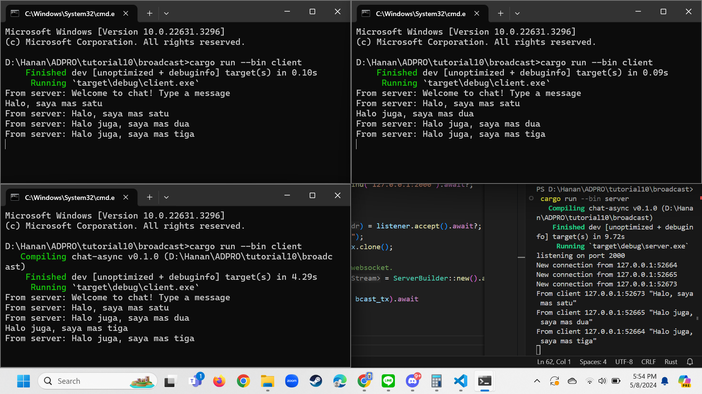

## 2.1

Run server dijalankan dengan: `cargo run --bin server`
Run client dijalankan denga: `cargo run --bin client`

Ketika client di run saat server aktif, maka client akan terhubung ke server. Client-client yang terhubung setiap kali memberikan pesan akan diterima pesannya oleh client yang lain.

Contohnya mas satu memberikan pesan, mas dua dan mas tiga mendapatkannya. Begitu juga mas dua dan mas tiga seterusnya.