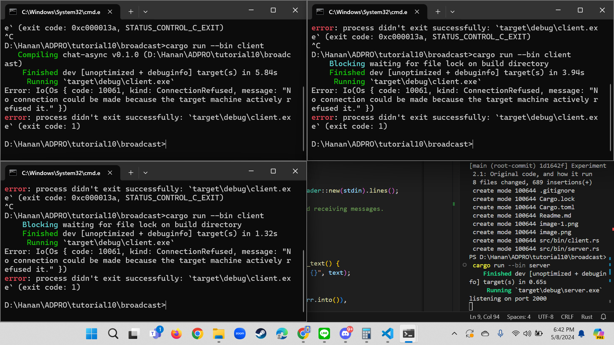
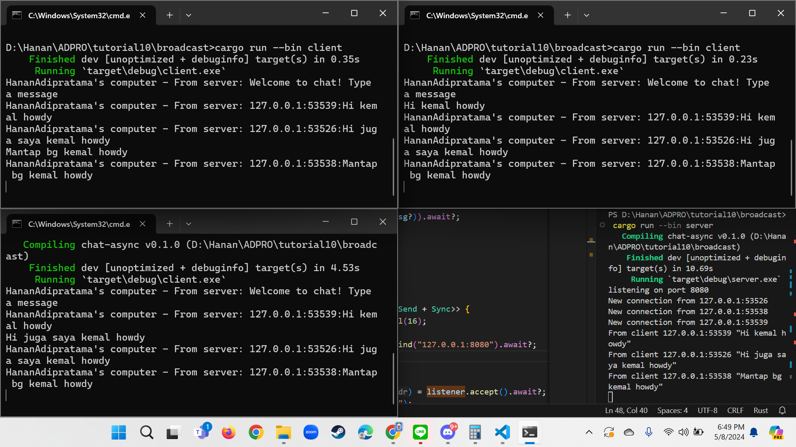

## 2.1

Run server dijalankan dengan: `cargo run --bin server`
Run client dijalankan denga: `cargo run --bin client`

Ketika client di run saat server aktif, maka client akan terhubung ke server. Client-client yang terhubung setiap kali memberikan pesan akan diterima pesannya oleh client yang lain.

Contohnya mas satu memberikan pesan, mas dua dan mas tiga mendapatkannya. Begitu juga mas dua dan mas tiga seterusnya.

## 2.2

Karena port antara server dan client berbeda, akibatnya client tidak bisa terhubung ke server.

## 2.3

Dengan modifikasi di server.rs
```
bcast_tx.send(format!("{addr}:{text}"))?;
...
TcpListener::bind("127.0.0.1:8080").await?;
    println!("listening on port 8080");
```
dan di client.rs
```
println!("HananAdipratama's computer - From server: {}", text);
```
sehingga server bisa menangkap alamat client dan menampilkannya di pesan.